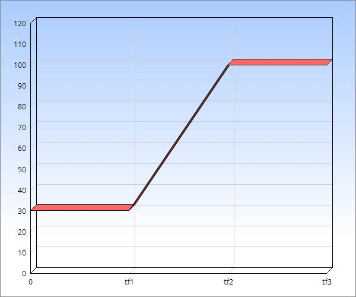
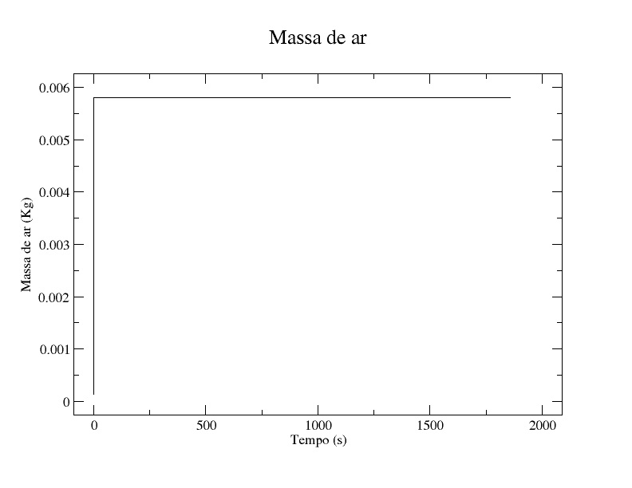
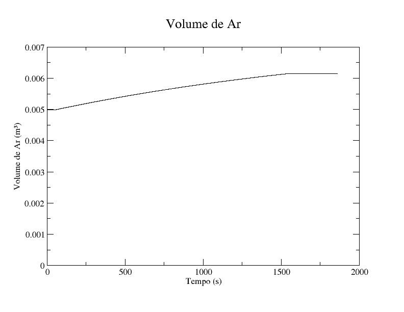
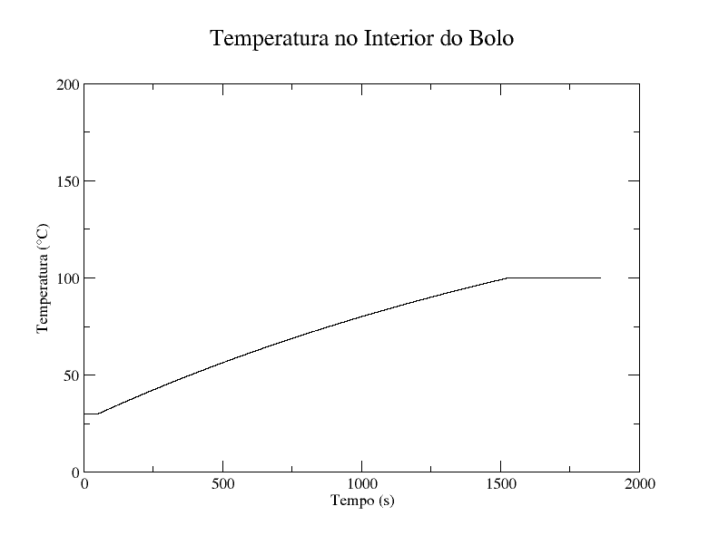
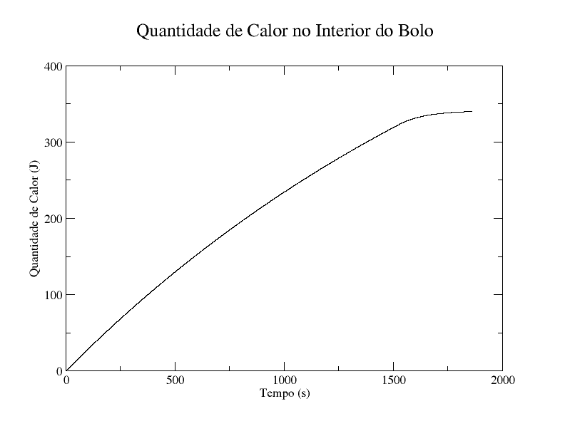

# Pound Cake
Inspirado pelo artigo [Modeling of Pound Cake Baking Behaviour in Continous Flow](https://www.comsol.com/paper/modeling-of-pound-cake-baking-behavior-in-continuous-flow-66621), fiz um hackaton sábado de manhã onde o propósito era modelar em uma abordagem termodinâmica e mais simples, um Pound Cake (Bolo de uma libra)
Iremos fazer um bolo de uma libra, onde todos os ingredientes são colocados na mesma quantidade (1 lb of each).
Para rodar o código, siga as [instruções](#como-eu-executo-esse-código) no final deste arquivo

### Ingredientes

    - Manteiga
    - Açúcar
    - Ovo
    - Farinha
    - Fermento
    - Sal a gosto
	
### A física por trás da receita
Manteiga adiciona ar e água ao bolo, fermento adciona ar, a clara do ovo adciona água e mantém o ar dentro do bolo.O açúcar ao atingir temperaturas entre 160º~170ºC é responsável pelas reações de Maillard (caramelização) dando o típico aroma de bolo pronto e por nos dizer que é hora de tirar o bolo do forno

1ª Fase - Manteiga derrete e fermento infla o bolo

    Calculamos como a massa de ar aumenta a medida que o tempo passa até derreter toda a manteiga, o que ocorre a temperatura 
    de 30ºC.
        - equação do do calor latente Q=mL  
        - teoria cinética química para a reação do fermento
        - dilatação térmica para o volume de ar
        
Fase 2 - Crescimento do bolo

    - Usamos o a lei de Newton do resfriamento/aquecimento para a variação da temperatura do bolo ao longo tempo, 
    até atingir os 100 ºC
    - expansão volumétrica para o volume de ar dentro do bolo
    - o calor específico do ovo varia com a temperatura
    
Fase 3 - Reações de Maillard
    - Cozimento do interior do bolo em 100 ºC
    - Caramelização na casca do bolo em 175 ºC; ponto de parada
    - perda de massa de água
    
### Gráficos
Do código bolo.f90 temos como saída, os arquivos .dat que ao utilizar o software xmGrace podem ser transformados nas seguintes imagens:

### Como eu executo esse código??? 
O Fortran90 é uma linguagem de programação compilada, por tanto precisamos instalar um compilador de fortran, caso já não tenha instalado, 
minha sugestão é utilizar o gfortran
Para rodar o código é necessário compilá-lo e depois executar o arquivo de extensão ".x" gerado.

Com o arquivo do programa salvo, compile com o comando:

  gfortran -o bolo.x bolo.f90

Estamos dizendo ao compilador para não gerar o objeto e pedindo para ele gerar um executável bolo.x a partir do arquivo prog1.f90.
Execute o programa gerado da forma:

  ./bolo.x

